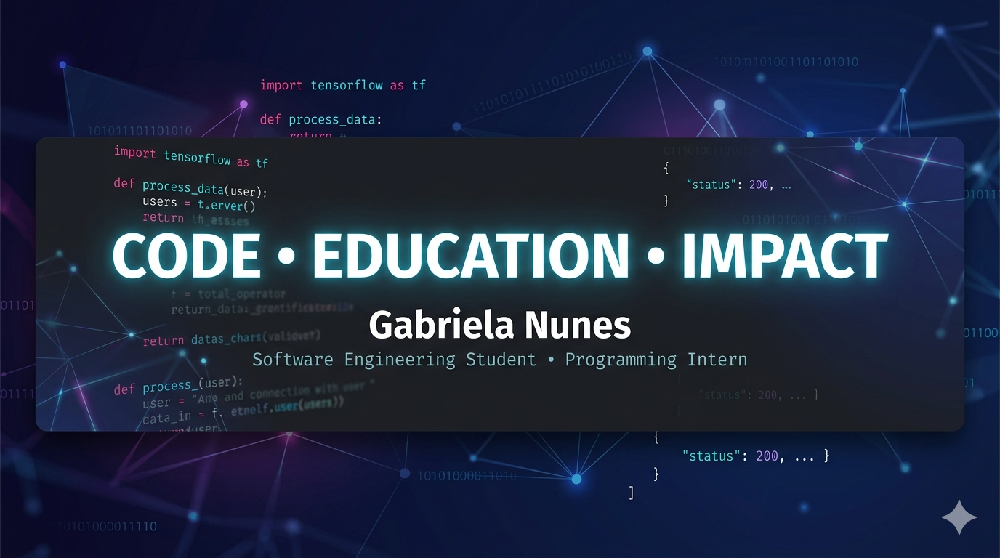

  

# Olá, eu sou a Gabriela Nunes 👋

💻 Estagiária de Programação | Desenvolvedora de Software em Formação  
🎓 Engenharia de Software (6º período)  
🚀 Desenvolvimento Web, Mobile e Tecnologia Educacional  
📍 Rio de Janeiro, Brasil  

---

# 👩‍💻 Sobre Mim

Sou estudante de **Engenharia de Software** e formada como **Técnica em Desenvolvimento de Sistemas pelo Colégio Pedro II**.

Atualmente atuo como **Estagiária de Programação na Casa Brasil, através da Tingle Digital**, contribuindo no desenvolvimento, manutenção e evolução de soluções digitais utilizadas por usuários reais.

Minha atuação envolve diferentes etapas do ciclo de desenvolvimento de software, incluindo análise de demandas, implementação de funcionalidades, correção de bugs, testes, documentação técnica e suporte à evolução dos sistemas.

Tenho experiência prática com desenvolvimento **Web e Mobile**, Firebase, Firestore, APIs REST, integração de serviços, análise de requisitos, regras de negócio e resolução de problemas técnicos.

Busco evoluir continuamente em **engenharia de software, arquitetura de sistemas, cloud computing e boas práticas de desenvolvimento**.

---

# 💼 Experiência Profissional

## 🚀 Estagiária de Programação | Casa Brasil

**Atuação através da Tingle Digital**

Atuação no desenvolvimento e evolução de uma plataforma educacional, contribuindo na implementação de funcionalidades, manutenção do sistema e resolução de demandas técnicas.

### Atividades:

✔ Desenvolvimento de funcionalidades Web e Mobile  
✔ Manutenção e evolução de sistemas existentes  
✔ Correção de bugs e melhorias contínuas  
✔ Integração com Firebase, Firestore e APIs REST  
✔ Análise de requisitos e regras de negócio  
✔ Testes e validação de funcionalidades (QA)  
✔ Documentação técnica das implementações  
✔ Análise e resolução de chamados  
✔ Suporte técnico inicial aos usuários  
✔ Investigação de problemas em ambientes de desenvolvimento e produção  
✔ Participação em Code Review  

---

# 🌟 Principais Contribuições

## 🤖 Módulo de Inteligência Artificial

Desenvolvimento e evolução de um módulo integrado com Inteligência Artificial.

### Atuação:

- Implementação de funcionalidades do módulo;
- Integração entre aplicação, backend e serviços externos;
- Estruturação de fluxos de interação;
- Persistência e organização de histórico de conversas;
- Melhorias e ajustes técnicos.

### Tecnologias:

Flutter • Firebase • Python • FastAPI • APIs REST

---

## 📋 Sistema de Gestão de Solicitações

Desenvolvimento e manutenção de funcionalidades para gerenciamento de solicitações internas.

### Atuação:

- Evolução de fluxos do sistema;
- Implementação de novas funcionalidades;
- Correção de problemas identificados em testes e produção;
- Análise técnica de demandas;
- Melhorias baseadas nas necessidades dos usuários.

### Tecnologias:

Flutter • Firebase • Firestore • Python

---

## 📊 Módulo de Relatórios e Análise de Dados

Atuação na análise, correção e evolução de funcionalidades relacionadas à geração de relatórios da plataforma.

### Atuação:

- Análise técnica dos relatórios existentes;
- Investigação de inconsistências nos dados;
- Análise de regras de negócio;
- Correção de relatórios e pipelines;
- Validação de resultados;
- Documentação das soluções aplicadas.

### Tecnologias:

Flutter • Firebase • Firestore • Cloud Functions

---

# 🚀 Projeto em Destaque

## 🔹 EPES Startup Challenge

Aplicação desenvolvida para um ambiente educacional de empreendedorismo e programação.

O projeto permitiu que alunos simulassem a criação e gestão de empresas em uma experiência prática.

### Minha atuação:

- Desenvolvimento de interfaces utilizando React e TypeScript;
- Implementação de telas e fluxos da aplicação;
- Integração com Firebase Authentication;
- Integração com Firestore;
- Correção de bugs;
- Melhorias de usabilidade e experiência do usuário.

### Tecnologias:

React • TypeScript • Firebase • Firestore • Vite

---

# 🛠 Tecnologias e Ferramentas

## Linguagens

HTML • CSS • JavaScript • TypeScript • Python

## Front-End & Mobile

React • Flutter • Tailwind CSS • Vite

## Backend, Cloud & Banco de Dados

Node.js • Python • Firebase • Firestore • Google Cloud • APIs REST

## Ferramentas

Git • GitHub • WordPress

---

# 🎓 Formação

🎓 **Engenharia de Software**  
6º período | Em andamento

🎓 **Técnico em Desenvolvimento de Sistemas**  
Colégio Pedro II

🎓 **Oracle Next Education (ONE)**  
Oracle + Alura

---

# 📚 Atualmente Estudando

- Arquitetura de Software;
- APIs REST;
- Banco de Dados e SQL;
- Git Avançado;
- Cloud Computing;
- Firebase Avançado;
- Segurança de Software;
- Inglês para Tecnologia.

---

# 🏆 Experiência em Destaque

✨ Desenvolvimento de funcionalidades em sistemas utilizados por usuários reais.

✨ Atuação com Web, Mobile, Inteligência Artificial e análise de dados.

✨ Participação em diferentes etapas do ciclo de desenvolvimento de software.

✨ Experiência com manutenção, correção de bugs e evolução contínua de sistemas.

---

# 📬 Contato

📧 gabinpaiva67@gmail.com

💼 LinkedIn:  
www.linkedin.com/in/gabriela-nunes-dev

📍 Rio de Janeiro - RJ

---

💙 **CODE • EDUCATION • IMPACT**

Transformando ideias em soluções através da tecnologia.

